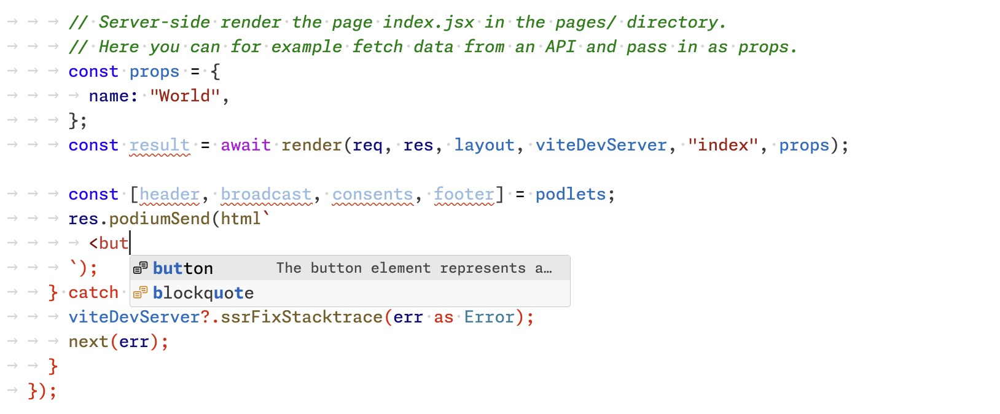

import Tabs from "@theme/Tabs";
import TabItem from "@theme/TabItem";

The latest release of Podium 5 introduces the `html` [template literal](https://developer.mozilla.org/en-US/docs/Web/JavaScript/Reference/Template_literals) to help reduce the risk of cross-site scripting (XSS) vulnerabilities in your applications, both [layouts](/docs/api/layout#html) and [podlets](/docs/api/podlet#html).

Passing strings directly to `podiumSend` is still supported, but is [now considered deprecated](#deprecating-string-inputs-to-podiumsend).

<Tabs groupId="app-type">
<TabItem value="layout" label="Layout">

```js
// Use the new named export `html`
import Layout, { html } from "@podium/layout";
import express from "express";

const app = express();

const layout = new Layout({
  name: "my-layout",
  pathname: "/",
});

const myPodlet = layout.client.register({
  name: "my-podlet",
  uri: "http://localhost:7100/manifest.json",
});

app.use(layout.middleware());

app.get(layout.pathname(), async (req, res) => {
  const incoming = res.locals.podium;
  const response = await myPodlet.fetch(incoming);

  incoming.podlets = [response];

  // Use the `html` template literal on the content you pass to `podiumSend`
  res.podiumSend(html`
    <div>This is the layout's HTML content</div>
    <!--
      Note that you need to pass in the response object here,
      not response.content – otherwise the podlet HTML gets escaped!
    -->
    ${response}
  `);
});
```

</TabItem>
<TabItem value="podlet" label="Podlet">

```js
// Use the new named export `html`
import Podlet, { html } from "@podium/podlet";
import express from "express";

const app = express();

const podlet = new Podlet({
  name: "myPodlet",
  version: "1.0.0",
  pathname: "/",
  development: true,
});

app.use(podlet.middleware());

app.get(podlet.content(), (req, res) => {
  // Use the `html` template literal on the content you pass to `podiumSend`
  res.status(200).podiumSend(html`<h2>Hello world</h2>`);
});
```

</TabItem>
</Tabs>

## Risk of cross-site scripting

Up until now Podium has not included any safety measures against cross-site scripting, instead leaving that up to application developers. Unfortunately, it's easy to forget to account for malicious inputs, especially when many meta-frameworks do this type of mitigation for you by default.

In the example below an attacker can construct a link where the `id` parameter closes the `div` tag and injects a malicious script instead.

```js
app.get("/:id", async (req, res) => {
  const { id } = req.params;
  const { publicPathname } = res.locals.podium.context;
  const { step } = req.query;

  res.podiumSend(`
    <!--
      Don't do this! Here transactionId is passed raw in the HTML output,
      introducing a cross-site scripting vulnerability. `transactionId`
      must be escaped first before being used this way.
    -->
    <div data-id=${transactionId}>
    </div>
  `);
});
```

## How the html template literal mitigates XSS

Under the hood `html` uses the [escape-html](https://www.npmjs.com/package/escape-html) library on the values that get passed to the template.
This way you can include inputs from the request in the output and not end up with unexpected HTML.

```js
app.get("/:id", async (req, res) => {
  const { id } = req.params;
  const { publicPathname } = res.locals.podium.context;
  const { step } = req.query;

  // Now `transactionId` is run through `escape-html` before it's safely included in the document
  res.podiumSend(html`
    <div data-id=${transactionId}>
    </div>
  `);
});
```

There are two exceptions that don't get escaped:

- [The result of a podlet `fetch`](#pass-in-the-whole-podlet-response).
- [Strings wrapped in `DangerouslyIncludeUnescapedHTML`](/docs/api/layout#dangerouslyincludeunescapedhtml).

## Pass in the whole podlet response

Since we trust the HTML content coming from podlets the `html` template literal looks for the response type from a Podium client `fetch` call and includes them without escaping.

```js
app.get(layout.pathname(), async (req, res, next) => {
  const incoming = res.locals.podium;

  const [aResponse, bResponse] = await Promise.all([
    podletA.fetch(incoming),
    podletB.fetch(incoming),
  ]);

  incoming.podlets = [aResponse, bResponse];

  res.podiumSend(html`
    <!-- NB! Don't send in aResponse.content, otherwise it gets escaped! -->
    ${aResponse}
    ${bResponse}
  `);
});
```

## Syntax highlighting and completions in editors

Several frameworks have a similar `html` template literal, for example [Lit](https://lit.dev).

Editor plugins for Lit typically include HTML features in strings that have the `html` template literal. In other words you can install [`lit-plugin` for VS Code](https://marketplace.visualstudio.com/items?itemName=runem.lit-plugin) to get syntax highlighting and completions in Podium `html` template literals.



## Use escape for API inputs

The `html` template literal is designed for `podiumSend`, but an application may include one or more APIs that don't return HTML. For them, use `escape`, available for both  [layouts](/docs/api/layout#escape) and [podlets](/docs/api/podlet#escape).

```js
app.get("/:id", async (req, res) => {
  const safeId = escape(req.params.id);
});
```

## Deprecating string inputs to podiumSend

We wanted to get this in the hands of developers without breaking existing APIs. However, in the interest of security-by-default we are now deprecating string-based inputs to `podiumSend`.

Please start using the `html` template literal to make future upgrades of Podium simpler.

```js
app.get("/", (req, res) => {
  // This is now deprecated!
  res.podiumSend(`<h2>Hello world</h2>`);
});
```

```js
app.get("/", (req, res) => {
  // Use the html template literal to future-proof
  res.podiumSend(html`<h2>Hello world</h2>`);
});
```

